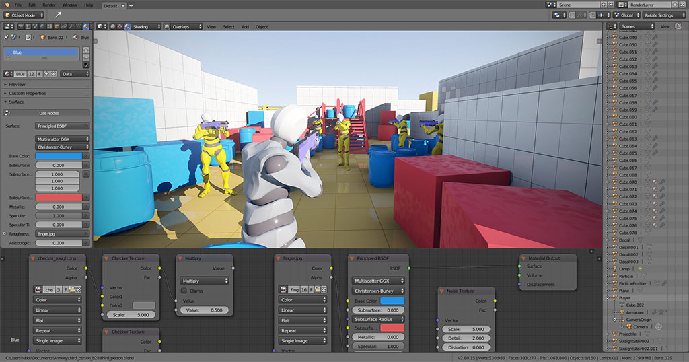

# Bienvenue

Élaborer des jeux dans Blender - Armory est un moteur de jeu avec intégration complète dans Blender, le transformant en un outil de développement de jeu complet.

*Armory n'est pas encore prêt pour la production, veuillez lire ce manuel avant de commencer. Nous sommes toujours à la recherche d'autres commentaires - faites-nous part des problèmes que vous rencontrez sur [GitHub](https://github.com/armory3d/armory/issues).*.

Voir la documentation en [HTML](https://softyoda.github.io/FR_armory_docs/).
---

Armory SDK peut être utiliser sur **Windows**, **Linux** et **macOS**. Les projets peuvent être déployés sur ordinateur, mobile, web et consoles.

### Commencer

- [Télécharger le SDK](http://armory3d.org/download.html)
- [Installer](./getting_started/setup.md)
- [Playground Tutorial](./getting_started/playground.md)
- [Tutoriel avec les tank](./getting_started/tanks.md)

### Essentiels

- [Game Templates](https://github.com/armory3d/armory_templates/releases)
- [Archviz Templates](https://github.com/armory3d/archviz_templates/releases)
- [Examples](https://github.com/armory3d/armory_examples/releases)
- [Global Illumination](./graphics/global_illumination)
- [Voxel World](https://github.com/armory3d/voxel_world)
- [Material Vault](https://github.com/armory3d/material_vault)

### License
Armory est distribué sous [licence zlib](https://github.com/softyoda/armory_docs/blob/master/LICENSE.md). Cela signifie que Armory est libre d'utilisation à toutes fins, y compris le développement de logiciels propriétaires à code source fermé et la vente de copies de votre travail. 

### Contribuer

Toute forme de contribution est la bienvenue ! Veuillez jeter un coup d'œil à la page [issues](https://github.com/armory3d/armory/issues) sur GitHub.
